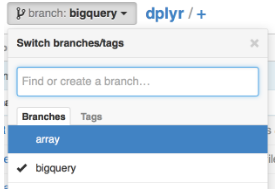
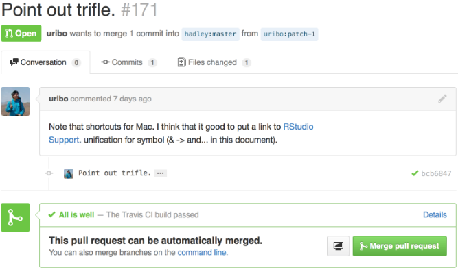
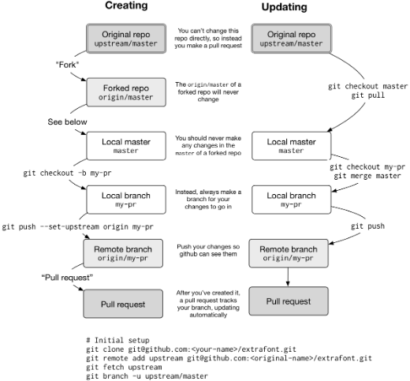

```{r rsetup, echo = FALSE}
knitr::opts_chunk$set(eval = FALSE, error = FALSE, engine = "bash")
```
```{bash bsetup, echo = FALSE}
knitr::opts_chunk$set(eval = FALSE, error = FALSE)
```

# Introduction

Git is a version control (VCS) system for tracking changes to projects. Version
control systems are also called revision control systems or source code
management (SCM) systems. These projects can be large-scale programs like the
Linux kernel, small scale projects like your own R development, homework 
assignments, papers, or thesis. There are many other VCSs available (subversion 
and Mercurial are currently used extensively in opens source projects) but Git 
is one of the easier ones. It is also well supported by GitHub.

You can install Git on your own Linux system. Git is available for installation
as a package within most Linux distributions and can be installed that way
(e.g. using yum or dnf on Red Hat systems or apt-get on Debian systems, or their
graphical interfaces). You can also install from source code.

A number of programming editors, called Integrated Development Enviornments 
(IDEs) include Git support. Several Emacs Git modes are available. RStudio has
integrated Git support. Checkout other instructions available at 
<http://happygitwithr.com/>.

There is a graphical interface git-gui that may be useful. A git book for more 
details can be found here <https://git-scm.com/book/en/v2>. In our opinion (C 
course on coursera), reading (trying out, and understanding) the first two 
chapters is a “must” even for those who are only casually interested in learning 
to program. If you are interested in serious software development you should 
master chapters 3–6 quickly. The GitHub help <https://help.github.com/>, not 
only teaches you about GitHub, but also has good tutorials on many Git features.

# Installation

Before starting to use Git you should first tell Git who you are so that you can
be identified when you make contributions to projects. This can be done by
specifying your name and email address.

In the shell, use
```{bash, error = FALSE}
git config --global user.name "Your Name Comes Here"
git config --global user.email "your_email@yourdomain.example.com"
```

__If you have spaces in the name you provide then be sure to enclose the name__
__in quotation marks. (You can check if you're set up correctly by running__
__`git config --global --list`.)__
These two commands only need to be __executed once__ per machine/system. The
information you provide is included in a `.gitconfig` file in your home 
directory and is used to label your actions in the Git log.

Aditionally, two configs can be added for convenience (nice but not necessary): 
`push.default` specifies particular debug behaviours related to git 1/2 but is
not strictrly necessary. One can specify the core editor git uses to open things
by `core.editor`. For a private repository, you are by default asked every
single time for validation via username and password. As this can be annoying,  
specify to keep track of these settings for e.g. 600,000 seonds with 
`credential.helper`.

```{bash, error = FALSE}
$ git config --global push.default simple
$ git config --global core.editor subl
$ git config --global credential.helper "cache --timeout=600000"
```

Once you are in the project directory, you need to initialize your Git
repository with the command git init so that Git knows that it needs to track
changes here.

```{bash, error = FALSE}
luke@nokomis ~/myproject% git init
Initialized empty Git repository in /home/luke/myproject/.git/
```

If you type `ls -a` you will see a directory named `.git` has been added.
This directory stores all of the history information and other configuration
data. Don't touch this directory.

Wheneverer we talk about _repo_ we mean basically the collection of everything
i.e. all files, all versions of files (all their history) etc.

If needed, generate a SSH key. For example, before creating a Git repo on Github
you need to generate a SSH-key which is passed to GitHub. 
__It's fine to pass a key for every machine you are using.__

SSH keys allow you to securely communicate with 
websites without a password. There are two parts to an SSH key: one public, one
private. People with your public key can securely encrypt data that can only be 
read by someone with your private key.

From R, you can check if you already have an SSH key-pair by running
```{r}
file.exists("~/.ssh/id_rsa.pub")
```
If that returns __FALSE__, you'll need to create a new key. You can either 
follow the instructions on GitHub 
<https://help.github.com/arcticles/generating-ssh-keys> or use RStudio. Go to
RStudio's global options, choose "Git/SVN-panel", and click "Create RSA key...".
Then, give GitHub your SSH public key: <https://github.com/settings/ssh>. The 
easiest way to find the key is to click "View public key" in RStudio's Git/SVN 
preferences pane.

# Benefits of using GitHub

1.    You get a decent website. The GitHub page for your project, e.g. 
      <https://github.com/hadley/testthat> (the GitHub repo for testthat), lists
      all the files and directories in your package. .R files will be formatted 
      with syntax highlighting, and .md/.Rmd files will be rendered as HTML. And
      if you include a README.md file in the top-level directory, it will be 
      displayed on the homepage. You'll learn more about the benefits of 
      creating this file in README.md.

1.    It makes it easy for anyone to install your package (and to benefit from 
      your hard work):
      `devtools::install_github("<your_username>/<your_package>")`

1.    You can track the history of the project in the commit view, e.g.
      <https://github.com/hadley/testthat/commits/master>. When I'm working on a
      package with others, I often keep this page open so I can see what they're
      working on. Individual commits show the same information that you see in
      the commit/diff window in RStudio.

1.    It's easy to see the history of a file. If you navigate to a file and click
      History, you'll see every commit that affected that file. Another useful 
      view is __Blame__; it shows the last change made to each line of code, who
      made the change, and the commit the change belongs to. This is 
      tremendously helpful when you're tracking down a bug. You can jump 
      directly to these pages from RStudio with the Git dropdown in the main 
      toolbar.

1.    You can comment on commits. To comment on the commit as a whole, use the 
      comment box at the bottom of the page. To comment on an individual line, 
      click the plus sign that appears when you mouse over a line number. This
      is a great way to let your collaborators know if you see a mistake or have
      a question. It's better than email because it's public so anyone working 
      on the repo (both present and future) can see the conversation.

# Working with remote repositories

For collaboration or backup it is useful to have your local repository linked to
a remote one e.g. on a GitHub server. There are two ways: I. start with some 
RStudio project and export it to a remote repo on Github or II. start with a 
GitHub repo and clone it i.e. create a new local repo that is linked to the 
remote one.

## I. Exporting a project from RStudio to GitHub

Before creating a Git repo you need to set Git as a version control system in 
the global options of RStudio and generate a SSH-key which is passed to GitHub.
__It's fine to pass a key for every machine you are using.__

To create a __local__ Git repo:

*   Set up a project
*   go to the project folder and type `git init`
*   restart RStudio

To synchronise with GitHub:

*   Create a new repo on GitHub: <https://github.com/new>. Give it the same name
    as your package, and include the package title as the repo description. 
    Leave all the other options as is, then click "submit".
*   **Before you execute the commands below (more precisely,**
    __`git push -u origin master`), make sure you have made an initial commit__
    __within the R-project, tracking all initial files (otherwise there is__
    __just nothing to push to GitHub).__
*   Open a shell, then follow the instructions on the new repo GitHub page.
    They might look like this:
    ```{bash, error = FALSE}
    git remote add origin https://github.com/useRaddictIZ/PGAS_KZ.git
    git push -u origin master
    ```
    The first line tells Git that your local repo wants to have a remote version 
    (on Github) and calls it "origin" (but any name is fine). What happens is
    that Git makes an association with the remote location. The second line 
    pushes all your current work to that repo. After pushing your local branch 
    with `-u` option, this local branch will be automatically linked with the 
    remote branch, and you can use git pull without any arguments. It's 
    (probably) almost the same as `git push --set-upstream origin master` 
    (google the details). Note, that this copies all revisions, commits, log 
    messages etc. to the remote. There is a difference between remote URLs with 
    SSH or HTTPS. HTTPS works for me, but alternatively 
    git@github.com/useRaddictIZ/PGAS_KZ.git can be used. More help can be found 
    on <https://help.github.com/articles/changing-a-remote-s-url/>. Notably, the 
    types can be switched:
    ```{bash, error = FALSE}
    git remote -v
    git remote set-url origin https://github.com/useRaddictIZ/PGAS_KZ.git
    ```
    Pushing everything for the first time requires username and password. After
    this is done you can see all files on the GitHub page.

Now let's make a commit and verify that the remote repo updates: Modify
DESCRIPTION to add URL and BugReports fields that link to your new GitHub site.
For example, dplyr has:
```{bash, error = FALSE}
URL: http://github.com/hadley/dplyr
BugReports: http://github.com/hadley/dplyr/issues
```
Save the file and commit (with the message "Updating DESCRIPTION to add links to
GitHub site"). Push your changes to GitHub by clicking "push". (This is the same
as running `git push` in the shell). Go to your GitHub page and look at the
DESCRIPTION.

Usually, each push will include multiple commits. This is because you push much
less often than you commit. How often you push versus commit is completely up to
you, but pushing code means publishing code. So strive to push code that works.

To ensure your code is clean, I recommend always running R CMD check before you
push (a topic you'll learn about in the chapter on automated checking). If you
want to publish code that doesn't work (yet), I recommend using a branch, as
you'll learn about below in the branching section.

Once you've connected your repo to GitHub, the Git pane will show you how many
commits you have locally that are not on GitHub: "Your branch is ahead of
origin/master by xxx comits". This message indicates that I have xxx number 
commit locallys (my local branch: master) that is not on GitHub
("origin/master").

## II. Cloning a GitHub repo into a local RStudio project repo

Now, the goal is to make a local copy of the Github repo into wherever RStudio
is running. We put it into a project: create a project, use third option
"version control", choose Git. 
The _Repository URL_ comes from GitHub:  Go to the Github repo and click on the
green button saying "Clone or Download", choose the clone option with HTTPS and
the repo name (not SSH). Copy/paste the URL into _Repository URL_ line in 
RStudio and specify the directory to be cloned into. Leave everything else blank
to take directory names from cloned repo names. Click "create project". Fill in
username and pw for Github and the repo is cloned into a local folder specified 
above. The so created _.Rproj_ specifies the root directory of the project and
other project options.

Alternatively, run `git clone https://github.com/useRaddictIZ/PGAS_KZ.git PATH`. 
The first argument specifies the location to clone from (make the copy of the 
repository) and `PATH` specifies the path for the local repo to copy to. 
Firstly, this creates an empty repository on the local computer. Secondly, it 
creates a remote called "origin" which is automatically set as the default place
to push and pull. Thirdly, git copies all comitts/files from the remote to the 
local repo. Again, to check the remote repository one is connected to with
`git remote -v`. Now editing, creating pushing and pulling works as always but 
make sure to `pull` first! (in I. you have to make an initial commit first so 
there is sth. to push, here first fetch all changes to be up to date with the
remote)

# Record changes

## 1. Visualize changes:

In the shell, use to see an overview of changes and to show detailed differences
```{bash, error = FALSE}
git status
git diff
```
In RStudio click on "Diff". The background colours tells you whether the text 
has been added (green) or removed (red). (If you're colourblind you can use the 
line numbers in the two columns at the far left as a guide: a number in the 
first column identifies the old version, a number in second column identifies 
the new version.) The grey lines of code above and below the changes give you 
additional context.


## 2. Commits:

The fundamental unit of work in Git is a commit. A commit takes a snapshot of
your code at a specified point in time. Using a Git commit is like using anchors
and other protection when climbing. If you're crossing a dangerous rock face you
want to make sure you've used protection to catch you if you fall. Commits play 
a similar role: if you make a mistake, you can't fall past the previous commit. 
Coding without commits is like free-climbing: you can travel much faster in the
short-term, but in the long-term the chances of catastrophic failure are high!
Like rock climbing protection, you want to be judicious in your use of commits.
Committing too frequently will slow your progress; use more commits when you're
in uncertain or dangerous territory. Commits are also helpful to others, because
they show your journey, not just the destination.

### 2.A. Creating commits:

*   There are five key components to every commit:
    * A _unique identifier_, called a SHA (short for secure hash algorithm).
    * A _changeset_ that describes which files were added, modified and deleted.
    * A human-readable _commit message_.
    * A _parent_, the commit that came before this one. (There are two exceptions
    to this rule: the initial commit doesn't have a parent, and merges, which
    you'll learn about later, have two parents.)
    * An _author_.

You create a commit in two stages:

1.  You __stage__ files, telling Git which changes should be included in the
next commit.
2.  You __commit__ the staged files, describing the changes with a message.

In RStudio, staging and committing are done in the same place, the commit
window, which you can open by pressing Ctrl + Alt + m.

The commit window is made up of three panes:

1.  Top-left pane: current status as the Git pane in the main RStudio window
1.  Bottom pane: shows the diff of the currently selected file (the same window 
    when clicking "Diff")
1.  Top-right pane: commit message 

To create a new commit:

1.  Save your changes.
1.  Open the commit window by pressing Ctrl + Alt + m.
1.  Select files: to stage (select) a single file for inclusion, tick its check
box, to stage all files press Ctrl/Cmd + A, then click stage. As you stage each
file, you'll notice that its status changes: the icon will change columns
(within the "Status column") from
right (unstaged) to left (staged), and you might see one of two
new icons:
    + Added: after staging an untracked file, Git now knows that you want to add
    it to the repo.
    + Renamed: If you rename a file, Git initially sees it as a deletion and
    addition. Once you stage both changes, Git recognises that it's a rename.
    + Sometimes you'll see a status in both columns. This means that you
    have both staged and unstaged changes in the same file. This happens when 
    you've made some changes, staged them, and then made some more. Clicking the
    staged checkbox will stage your new changes, clicking it again will unstage
    both sets of changes.
1.  Stage files, as above.
1.  Write a commit message (top-right panel) which describes the changes that
you've made. The first line of a commit message is called the subject line and
should be brief (50 characters or less). For complicated commits, you can follow
it with a blank line and then a paragraph or bulleted list providing more detail.
Write messages in imperative, like you're telling someone what to do: “fix this
bug”, not “fixed this bug” or “this bug was fixed”.
1. Click Commit.

Staging files is a little more complicated in the shell. You use `git add` to
stage new and modified files, and `git rm` to stage deleted files. To create
the commit, use `git commit -m <message>`. In more detail:

*   Type `git status` to see that origin/master and master are up to date.
*   Make changes to a file e.g. "test.R".
*   Once you are done editing the file, you can save/close it and run
    `git diff` to see a summary of the changes. The output shown here is
    the Unix `diff `format and it shows what lines were added, deleted, or
    changed. If a line has a `-`in front of it, that line was changed. If a line
    has a `+` in front of it, that line was added.
*   At this point you can always type `git status` to see that there are
    untracked files.
*   Type `git add test.R` to stage i.e. track the changes files.
*   At this point you can always type `git status` to see files that are changed
    but have yet to be commited: "Changes to be committed".
*   Now that you have added your new code file you can commit the change using
    `git commit`. The `git commit` command requires that you provide a short
    message about what the changes are and this can be done using the `-m` 
    switch. If you do not use this switch git will open an editor session for
    you to enter a message.
*   After committing the change you can run `git status` again. It should say
    something like
    ```{bash, error = FALSE}
    # On branch master
    nothing to commit (working directory clean)
    ```
    i.e. as in the beginning, master and origin/master are up to date
*   Since the combination of `git add` followed by `git commit` is so common
    there is a shortcut: `git commit -a.`
*   Now there are revisions in your project history. You can see the complete
    project history with `git log`.

In the end, after having created your commits, do not forget to push your
changes with `git push`.

### 2.B. Commit best practices:

Ideally, each commit should be minimal but complete:

*   __Minimal__: A commit should only contain changes related to a single problem.
This will make it easier to understand the commit at a glance, and to describe
it with a simple message. If you should discover a new problem, you should do a
separate commit.
*   __Complete__: A commit should solve the problem that it claims to solve. If
you think you've fixed a bug, the commit should contain a unit test that
confirms you're right.

Each commit message should:

*   __Be concise, yet evocative__: At a glance, you should be able to see what a
commit does. Yet there should be enough detail so you can remember (and
understand) what was done.

*   __Describe the why, not the what__: Since you can always retrieve the diff
associated with a commit, the message doesn't need to say exactly what changed.
Instead it should provide a high-level summary that focuses on the reasons for
the change.

If you do this:

*   It'll be easier to work with others. For example, if two people have changed
    the same place in a file, it'll be easier to resolve conflicts if commits 
    are small and it's clear why each change was made.

*   Project newcomers can more easily understand the history by reading the
    commit logs.

*   You can load and run your package at any point along its development
    history. This can be tremendously useful with tools like bisectr, which 
    allow you to use binary search to quickly find the commit that introduced a 
    bug.

*   If you can figure out exactly when a bug was introduced, you can easily
understand what you were doing (and why!).

You might think that because no one else will ever look at your repo, that
writing good commit messages is not worth the effort. But keep in mind that you
have one very important collaborator: future-you! If you spend a little time now 
polishing your commit messages, future-you will thank you if and when they need
to do a post-mortem on a bug.

Remember that these directives are aspirational. You shouldn't let them get in
your way. If you look at the commit history of my repositories, you'll notice a
lot of them aren't that good, especially when I start to get frustrated that I
still haven't managed to fix a bug. Strive to follow these guidelines, and
remember it's better to have multiple bad commits than to have one perfect
commit.

### 2.C. Ignoring files

Often, there are files that you don't want to include in the repository. They
might be transient (like LaTeX or C build artefacts), very large, or generated
on demand. Rather than carefully not staging them each time, you should instead
add them to `.gitignore`. This will prevent them from accidentally being added.
The easiest way to do this is to right-click on the file in the Git pane and
select "Ignore". If you want to ignore multiple files, you can use a wildcard 
glob like "*.png". 

Now, since files that are already being tracked will continue to be trackedby 
git, (e.g. previously added "*.png"-files) one has to remove them from the 
index. This is achieved by
```{bash}
git rm --cached <path>
git rm -r --cached <path>
```
where `<path>` refers to e.g. 
"~/Dropbox/research/GZ/data/doc/Data_Index_ilo.xls" for a file or 
"~/Dropbox/research/GZ/doc/" for a complete folder. Standard shell translation
applies here i.e. `rm` means "remove", `-r` refers to recursive and `--cached`
means "index" and not the true file (so without `--cached` the file would be 
lost!).

Some developers never commit derived files, files that can be generated
automatically. For an R package this would mean ignoring the files in the
NAMESPACE and man/ directories because they're generated from comments. From a
practical pespective, it's better to commit these files: R packages have no way
to generate .Rd files on installation so ignoring derived files means that users
who install your package from GitHub will have no documentation.

# Undoing a mistake 

## 1. Only changes, but no commits and no push

To undo the changes you've just made (but neither committed nor pushed), right
click on the file in the Git pane and select "revert". This will roll any
changes back to the previous commit. Beware: you can't undo this operation!
You can also undo changes to just part of a file in the diff window. Look for a
`discard chunk` button above the block of changes that you want to undo. You can
also discard changes to individual lines or selected text.

## 2. Changes and commits, but no push

Don't do the following if you've pushed the previous commit to GitHub (you're
effectively rewriting history, which should be done with care when you're doing
it in public).

If you committed changes too early, you can modify the previous commit by
staging the extra changes. Before you click commit, select "ammend previous
commit"

## 3. For changes and commits that are already pushed

If you didn't catch the mistake right away, you'll need to look backwards in
history and find out where it occurred: 

1.  Open the history window by clicking "history" in the Git pane. The history
    window is divided into two parts. The top part lists every commit to your repo.
    The bottom part shows you the commit: the SHA (the unique id), the author,
    the date, the parent and the changes in the commit. Alternatively, use
    `git log` which also shows commit identifier, the author of the commit, the
    date of the commit, and the short message that you provided with each commit.

1.  Navigate back in time until you find the commit where the mistake occurred.
    Write down the parent SHA: that's the commit that occurred before the mistake
    so it will be good. There are two options: either change one file or go back
    to that commit discarding all changes made from then
    *   See what the file looked like in the past so you can copy-and-paste the
        old code:
        ```{bash, error = FALSE}
            git merge master
        ```
        Or copy the version from the past back in to the present:
        old code:
        ```{bash, error = FALSE}
            git checkout <SHA> <filename>
        ```
        Checkout means to look at that branch/file 
        (working on that particular version of "present"). 
        In both cases you'll need to finish by staging and committing the files.
    *   Now suppose you decide that everything since a particular commit is not 
        that useful. You can resolve this situation with the git revert command.
        Notice in the `git log` that the most recent commit has some identifier
        (e.g. 6d8dafe72a198ed63d11be8592c39bcd14179a6b: NOTE: this identifier
        string may be different on your computer!). If you want to reverse the
        change that this commit introduced you can run
        ```{bash, error = FALSE}
            git revert --no-edit 6d8dafe
        ```
        and the code.R file will be reverted back to the version just before
        that commit. Note that you do not have to type in the entire identifier
        string at the command line—the shortest unique substring will suffice.
        Usually, using the first 7 characters is more than enough.
        Now when you run git log notice that history is not erased, but the
        revert is officially in the log.
        
## 4. Rebasing history

It's also possible to use Git as if you went back in time and prevented the
mistake from happening in the first place. This is an advanced technique called
rebasing history. As you might imagine, going back in time to change the past
can have a profound impact on the present. It can be useful, but it needs 
extreme care.

## 5. Final remarks and troubleshooting

If you're still stuck, try <http://sethrobertson.github.io/GitFixUm/fixup.html>
or <http://justinhileman.info/article/git-pretty/>. They give step-by-step
approaches to fixing many common (and not so common!) problems.

# Working with others

## 1. Branching

Sometimes you want to make big changes to your code without having to disturb
your main stream of development. Maybe you want to break it up into multiple
simple commits so you can easily track what you're doing. Maybe you are not sure
what you've done is the best approach and you want someone else to review your
code. Or maybe you want to try something experimental (you can merge it back
only if the experiment succeeds). Branches and pull requests provide powerful
tools to handle these situations. With git you can create different branches of 
development and these side branches can be used to test out new ideas or to 
explore past history.

Although you haven't realised it, you're already using branches. The default
branch is called __master__; it's where you've been saving your commits. If you
synchronise your code to GitHub you'll also have a branch called
__origin/master__: it's a local copy of all commits on GitHub which gets
synchronised when you pull. 

It's useful to create your own branches when you want to (temporarily) break
away from the main stream of development. First, I explain the general 
procedure and then make an example where we rewind the state of the repo to a 
previous commit. You can create a new branch with
```{bash, error = FALSE}
git checkout -b <branch-name>
```
Names should be in lower case letters and numbers, with - to separate words.

Switch between branches with `git checkout`, e.g. to return to the main line of
development use
```{bash, error = FALSE}
git checkout master.
```
You can also use the branch switcher at the top right of the Git pane.

If you've forgotten the name of your branch in the shell, you can use 
```{bash, error = FALSE}
git branch
* master
  test
```
to list all existing branches. The asterisk indicates you are on the master
branch, so you can do the merge.

If you try to synchronise this branch to GitHub from inside RStudio, you'll
notice that push and pull are disabled. To enable them, you'll need to first
tell Git that your local branch has a remote equivalent:
```{bash, error = FALSE}
git push --set-upstream origin <branch-name>
```

After you've done that once, you can use the pull and push buttons as usual.

If you've been working on a branch for a while, other work might have been going
on in the master branch. To integrate that work into your branch, run
```{bash, error = FALSE}
git merge master
```
You will need to resolve any merge conflicts (see below). It's best to do this
fairly frequently - the less your branch diverges from the master, the easier it
will be to merge. Once you're done working on a branch, merge it back into the
master, then delete the branch:
```{bash, error = FALSE}
git checkout master
git merge <branch-name>
git branch -d <branch-name>
```
(Git won't let you delete a branch unless you've merged it back into the master
branch. If you do want to abandon a branch without merging it, you'll need to
force delete with -D instead of -d. If you accidentally delete a branch, don't
panic. It's usually possible to get it back. See the advice about undoing
mistakes).

After a while, suppose you feel the work done on some `test` branch is in fact
useful and you want to merge that into your master branch. Again, you can call 
`git merge` to merge two branches together. You need to do this from a checkout
of the `master` branch:
```{bash, error = FALSE}
luke@nokomis ~/myproject% git merge test
Merge made by recursive.
 doc.txt |    1 +
 1 files changed, 1 insertions(+), 0 deletions(-)
 create mode 100644 doc.txt
```
Running `git log` gives us the history of the two branches merged together with 
a _merge commit_. Because we merged the test branch into the master branch we no
longer need it. A branch can be deleted with the `-d` switch to `git branch`.
Be careful when deleting branches; if you have not merged that branch into the
"master" then deleting a branch will lose all of the history associated with 
that branch.

A useful tool for viewing the branch structure of a Git archive is `gitk`.
Running `gitk` with the `--all` switch indicates that gitk should show all
branches.

Now, for example suppose you wanted to rewind the state of the repo to a 
previous commit but you don't want to revert all of the commits after that 
point to get to that previous commit (in other words you want to preseerve the 
project history as is). The simplest thing to do is to create a new branch at 
the point in the history that you are interested in exploring. 

First, take a look at where in the history you want to create your new branch 
with `git log`. Write down the commit identifier e.g. "6d8dafe..." after which
you want to create your new branch. Then, use `git checkout -b <branch-name>`
`6d8dafe...`. Now, you are on the test branch and running `git log` shows you
the history up to the commit "6d8dafe...". Here, you can make any tests and 
changes, stage and commit as you please without altering the master branch. To 
switch back to the master branch use `git checkout master` as explained before.

## 2. Pull requests

### I. Making a pull request

A pull request is a tool for proposing and discussing changes before merging 
them into a repo. The most common use for a pull request is to contribute to 
someone else's code: it's the easiest way to propose changes to code that you 
don't control.

Below, you'll learn about pull requests to make changes to your own code. This 
may seem a bit pointless because you don't need them, as you can directly modify
your code. But pull requests are surprisingly useful because they allow you to 
get feedback on proposed changes. We use them frequently at RStudio to get 
feedback before merging major changes.

GitHub has some good documentation on using pull requests: <https://help.github.com/articles/using-pull-requests/>. In this chapter, I'll 
focus on the basics you need to know to use pull requests effectively, and show 
you how they fit in with the Git commands you've learned so far.

To create a pull request, you create a branch, commit code, then push the branch
to GitHub. When you next go to the GitHub website you'll see a header that 
invites you to submit a pull request. You can also do it by:

1. Switching branches

{width=30%}

1. Clicking "Pull request"

This will create a page that looks like this

{width=75%}

The above pull request, which fixes a couple of small problems, is one that was 
submitted to this book's GitHub site.

There are three parts to a pull request:

1.    A "conversation" where you can discuss the changes as a whole.

1.    The "commits"  view where you can see each individual commit.

1.    The "file changes" where you see the overall diff of the commits, and you 
      can comment on individual lines.
      
Once you're done discussing a pull request, you either choose to merge it or 
delete it. Merging it is equivalent to running `git merge <branchname>` from the
shell; deleting is equivalent to `git branch -d <branchname>`.

### II. Submitting a pull request to another repo

To submit a pull request to a repo that you don't own, you first need to create 
a copy of the repo that you can own, called a __*fork*__, and then clone that 
fork on your own computer:

1.    Fork the original repo by going to the repo on GitHub and clicking "Fork".
      This creates a copy of the repo that belongs to you.

1.    Clone the forked repo to create a local copy of the remote repo. It's 
      possible to do this within RStudio (using "Create New Project" from 
      "Version Control") but I think it's easier to do it from the shell:
      `git clone git@github.com:<your-name>/<repo>.git`
      `cd <repo>`

A fork is a static copy of the repo: once you've created it, GitHub does nothing
to keep it in sync with the upstream repo. This is a problem because while 
you're working on a pull request, changes might occur in the original repo. To 
keep forked and original repo in sync, start by telling your repo about the 
upstream repo:
```{bash}
git remote add upstream git@github.com:<original-name>/<repo>.git
git fetch upstream
```
Then you can merge changes from the upstream repo to your local copy:
```{bash}
git merge upstream/master
```
When working on a forked repo, I recommend that you don't work on the master 
branch. Because you're not really working on the main line of development for 
that repo, using your master branch makes things confusing.

If you always create pull requests in branches, you can make it a little easier 
to keep your local repo in sync with the upstream repo by running:
```{bash}
git branch -u upstream/master   
```
Then you can update your local repo with the following code:
```{bash}
git checkout master
git pull
```
Changes may occur while you're working on the pull request, so remember to merge
them into your branch with:
```{bash}
git checkout <my-branch>
git merge master
```
A pull request (PR) is a one-to-one mapping to a branch, so you can also use 
this technique to make updates based on the pull request discussion. Don't 
create a new pull request each time you make a change; instead you just need to 
push the branch that the PR is based on and the PR webpage will automatically 
update.

The diagram below illustrates the main steps of creating a pull request and 
updating the request as the upstream repo changes:

{width=75%}

### III. Reviewing and accepting pull requests

As your package gets more popular, you're likely to receive pull requests. 
Receiving a pull request is fantastic. Someone not only cares about your package 
enough to use it, they've actually read the source code and made an improvement!

When you receive a pull request, I recommend reviewing it using the three step 
approach described by Sarah Sharp. I summarise the three phases below, but I 
highly recommend reading the full article at <http://sarah.thesharps.us/2014/09/01/the-gentle-art-of-patch-review/>:

1.    Is it a good idea? If you don't think the contribution is a good fit for
      your project, it's polite to let the contributor know as quickly as 
      possible. Thank them for their work, and refocus them on a better area 
      to work on.
1.    Is the overall approach sound? At this point you want to focus on the 
      big picture: have they modified the right functions in the right way? 
      Avoid nitpicking minor style problems (that's the final phase); instead 
      just provide a pointer to your style preferences, e.g. 
       <http://r-pkgs.had.co.nz/style.html>.
1.    Is it polished? In the final review phase, make sure that the non-code 
      parts of the PR are polished. Prompt the contributor to update the 
      documentation, point out spelling mistakes and suggest better wording.
1.    I recommend asking the contributor to include a bullet point in NEWS.md,
      briefly describing the improvement and thanking themselves with their 
      GitHub username. More details to follow in post
      <http://r-pkgs.had.co.nz/release.html#post-release>.

After discussion is complete, you can incorporate the changes by clicking the 
merge button. If the button doesn't work, GitHub provides some instructions on 
how to do it from the command line. While you've seen all the pieces before, 
it's useful to read through this just so you understand what exactly is 
happening.
```{bash}
# Create a new branch, and sync it with the pull request
git checkout -b <branch> master
git pull https://github.com/<user>/<branch>.git patch-3

# Merge the changes into the main line of development
git checkout master
git merge --no-ff <branch>
# Resolve conflicts, stage and add.

# Sync your local changes with GitHub
git push origin master
```


# Details about how git works & some general remarks

## 0. Getting help, collaboration ideas and issues

You can read the help page for a specific command by calling git help. For
example, if you wanted to read the help page for git status, you could call
```{bash, error = FALSE}
    git help status
```

Inserting help in between git and the command name will retrieve the help page
for that command

Some ways for collaborating using Git:

*   Set up a remote repository on a hosting service such as Github. All team
    members will clone this repository and use `git pull` and `git push` to 
    share their changes.
*   Have one team member maintain a git repository on a web page. Other team
    members clone this repository and pull changes from it. Changes made by
    others can be contributed to the repository maintainer as email patches.
*   Use shared disk space for the remote repository (physical space such as a
    USB drive or a sharing service like Dropbox).

Every GitHub repo comes with a page for tracking issues. Use it! If you 
encounter a bug while working on another project, jot a note down on the issues 
page. When you have a smaller project, don't worry too much about milestones, 
tags and assigning issues to specific people. Those are more useful once you get
over a page of issues (>50). Once you get to that point, read the GitHub guide 
on issues: <https://guides.github.com/features/issues/>.

A useful technique is closing issues from a commit message. Just put Closes 
_#issue number_ somewhere in your commit message and GitHub will close the issue 
for you when you next push. The best thing about closing issues this way is that
it makes a link from the issue to the commit. This is useful if you ever have to
come back to the bug and want to see exactly what you did to fix it. You can 
also link to issues without closing them; just refer to _#issue number_.

As you'll learn about in NEWS.md, it's a good idea to add a bullet to NEWS.md 
whenever you close an issue. The bullet point should describe the issue in terms
that users will understand, as opposed to the commit message which is written 
for developers.

## 1. Pull

You use push to send your changes to GitHub. If you're working with others,
they also push their changes to GitHub. But, to see their changes locally you'll
need to pull their changes from GitHub. In fact, to make sure everyone is in sync,
Git will only let you push to a repo if you've retrieved the most recent version
with a pull.

When you pull, Git first downloads (fetches) all of the changes and then merges
them with the changes that you've made. In particular, `git pull` does:

1.    `git fetch origin master` to update the local `origin/master` branch with
the latest commits from GitHub.

1.    `git merge origin/master` to combine the remote changes with your changes

## 2. Merging and resolving merge conflicts

When you pull, Git first downloads (fetches) all of the changes and then merges
them with the changes that you've made. A merge is a commit with two parents. It
takes two different lines of development and combines them into a single result.
In many cases, Git can do this automatically: for example, when changes are made
to different files, or to different parts of the same file. However, if changes
are made to the same place in a file, you'll need to resolve the merge conflict
yourself.

In RStudio you discover when you have a merge conflict when:

*   A pull fails with an error
*   In the Git pane, you see a status like yellow "U U"

RStudio currently doesn't provide any tools to help with merge conflicts, so 
you'll need to use the command line. I recommend starting by setting your merge 
conflict "style" to `diff3`. The `diff3` style shows three things when you get a 
merge conflict: your local changes, the original file and the remote changes. 
The default style is `diff2`, which only shows your changes and the remote 
changes. This generally makes it harder to figure out what's happened.

*   If you've encountered your first merge conflict, do the following:
    ```{bash}
    # Abort this merge
    git merge --abort
    # Set the conflict style
    git config --global merge.conflictstyle diff3
    # Re-try the merge
    git pull
    ```
*   If you're not in the middle of a merge conflict, just run:
    ```{bash}
    git config --global merge.conflictstyle diff3
    ```
    
To resolve a merge conflict, you need to open every file with the status yellow
"U U". In each file, you'll find a conflict marker that looks like this:

*   "<<<<<<< HEAD"

*   "||||||| merged common ancestors""

*   "=======""

*   ">>>>>>> remote""

This shows all three versions of the conflicting code:

*   At the top, your local code

*   In the middle, the code from the last commit before the split between the 
    two lines of development (This is missing in the default conflict style, so 
    if you don't see it, follow the instructions above).

*   At the bottom, the remote code that you pulled down from GitHub.

You need to work through each conflict and decide either which version is 
better, or how to combine both versions. Then, before you stage the file, make 
sure you've deleted all the conflict markers. Once you've fixed all conflicts, 
make a new commit and push to GitHub.

A couple of pointers when fixing text generated by roxygen:

*   Don't fix problems in `man/*.Rd` files. Instead, resolve any conflicts in 
    the underlying roxygen comments and re-document the package.

*   Merge conflicts in the `NAMESPACE` file will prevent you from re-loading or 
    re-documenting a package. Resolve them enough so that the package can be 
    loaded, then re-document to generate a clean and correct `NAMESPACE`.

Handling merge conflicts is one of the trickier parts of Git. You may need to 
read a few tutorials before you get the hang of it. Google and StackOverflow are
great resources. If you get terribly confused, you can always abort the merge 
and try again by running `git merge --abort` then `git pull`.


## 3. Summary of essential Git commands

*   `git status`: check status and see what has changed
*   `git add`: add a changed file or a new file to be committed
*   `git diff`: see the changes between the current version of a file and the version of the file most recently        committed
*   `git commit`: commit changes to the history
*   `git log`: show the history for a project
*   `git revert`: undo a change introduced by a specific commit
*   `git checkout`: switch branches or move within a branch
*   `git clone`: clone a remote repository
*   `git pull`: pull changes from a remote repoository
*   `git push`: push changes to a remote repository


## 3. Summary of essential Git workflow (following Colin Rundell video)

One can think of the process of changing files, staging and commiting in the 3
categories:

*   __(1) working stuff__:
    working copies of files, "all my messy stuff on the table", where I don't 
    know whether it is important or not, experimental things etc.
*   __(2) staged stuff__:
    I know it is important so I put it into a "mental folder" but I don't know
    when it becomes important to the extent that I want to track it via GitHub
*   __(3) committed stuff__:
    analogous to saving a file: now Git keeps track of it (locally though so it
    has to be pushed if changes are meant to occur on a remote repo)

How do __(1)__ to __(3)__ interact?

Changing a "file.R" in RStudio and saving it means there is a "working copy" of
"file.R" under __(1)__ that is different from the saved (lastly commited) 
version under __(3)__. In RStudio this shows up as a blue "M" icon saying the 
"file.R" is modified but not saved/tracked by GitHub.

Now, to move the "file.R" from the working version under __(1)__ to a staged
version in __(2)__ one either checks the "Staged" box or does `git add `
`"file.R"`.

Then, the next logical step is to commit with additional information/metadata 
via a commit message: either `git commit "file.R"` or via the "commit" button in
RStudio.

Recall that we talk about _repo_ when we mean basically the collection of
everything i.e. all files, all versions of files (all their history) etc. Now,
by default _origin_ is the name of the repo that is upstream from you and master
is the default name of the main branch.

Pushing implies that all changes you made on your local repo go to what's 
upstream of you.

In GitHub, by clicking on the pencil one can make changes, stage \& commit (at 
once). If one does this the GitHub repo is one commit ahead of your local repo.
Now, suppose you are changing s.th. to "file.R" but "file.R" has been changed by
sb. else (via a push or directly via GitHub as explained above). This means that
there are now two versions of "file.R" and two version histories of that file:
one is on GitHub and the other is on the local repo. 
